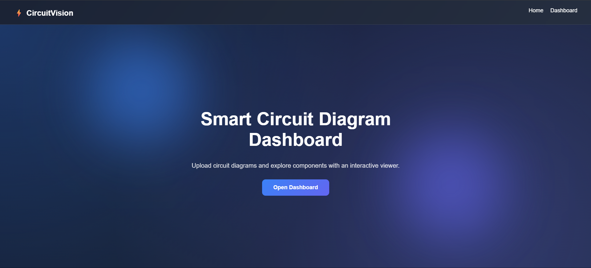
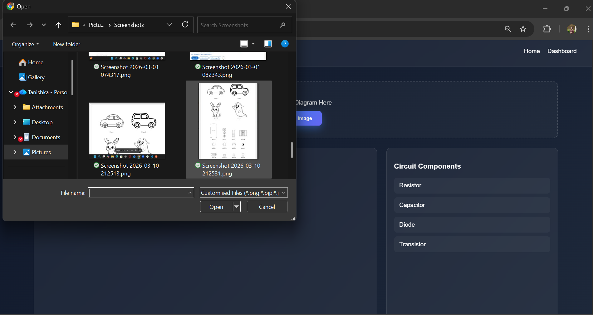
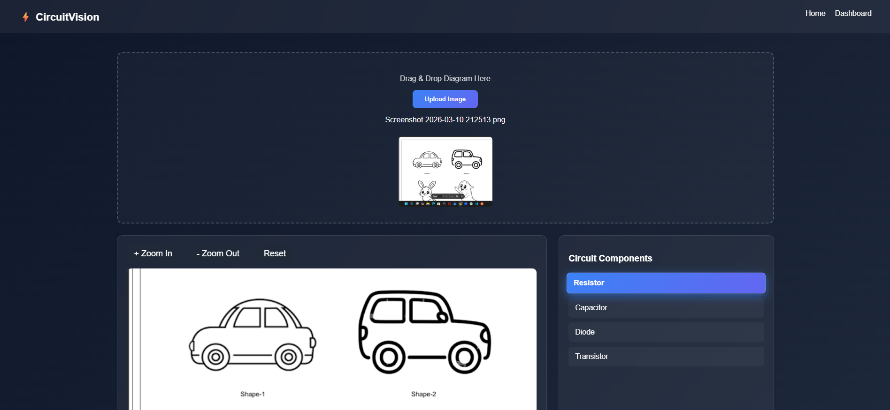
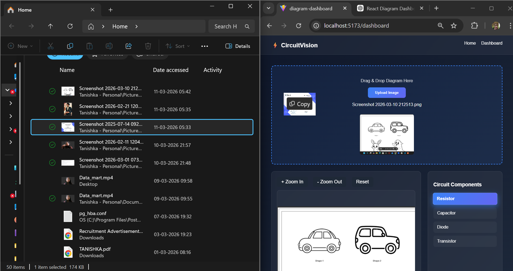
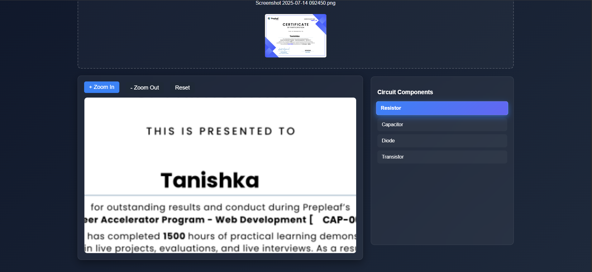
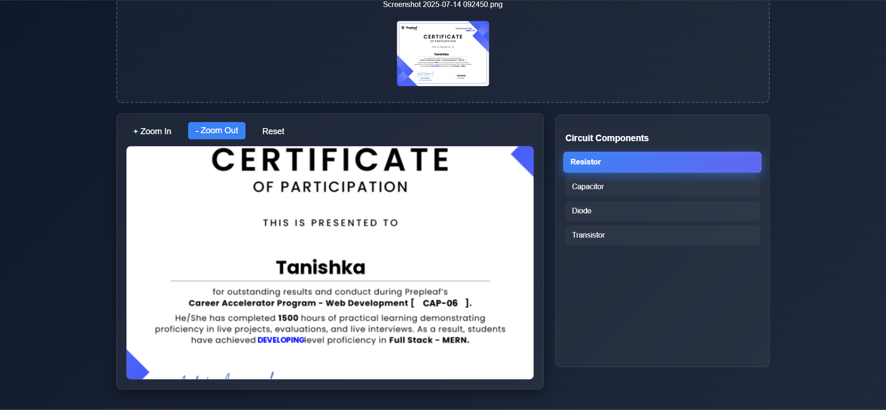
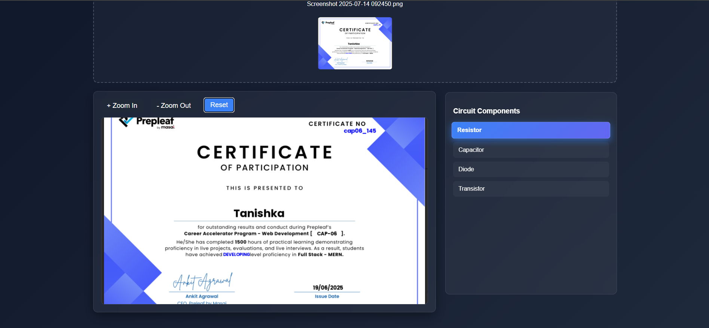

Here is a **complete professional README** you can directly put in your GitHub repository. It is written in a **clean structure that interviewers like**.

---

# ⚡ CircuitVision – Diagram Dashboard

A modern **React-based dashboard** that allows users to upload circuit diagram images and explore detected electronic components through an interactive viewer.

The application demonstrates **React fundamentals, component architecture, state management, responsive UI design, and modern CSS styling**.

---

## 🌐 Live Demo

You can view the live application here:

🔗 **Live Demo:**
https://diagram-dashboard.vercel.app/

---


# 🚀 Features

### 📤 Upload Diagram

* Upload circuit diagrams (PNG / JPG)
* Drag & Drop image upload
* Preview uploaded image
* Display uploaded file name
* Replace uploaded image anytime

---

### 🔍 Interactive Diagram Viewer

* Zoom In / Zoom Out controls
* Reset view button
* Mouse wheel zoom support
* Drag image with hand tool (pan functionality)

The viewer behaves similarly to tools like **Figma or Google Maps** where users can zoom and move the diagram smoothly.

---

### 📋 Components List Panel

Displays detected circuit components from a mock API.

Example components:

* Resistor
* Capacitor
* Diode
* Transistor

Features:

* Clickable components list
* Selected component highlighting
* Smooth hover animations

---

### 🎨 Premium UI Design

The dashboard includes:

* Glassmorphism card design
* Gradient buttons
* Smooth hover animations
* Responsive layout
* Elegant dark theme
* Micro animations for UI elements

---

### 📱 Responsive Layout

The UI adapts across devices:

Desktop Layout:
Upload section
Diagram viewer (left)
Components panel (right)

Tablet / Mobile Layout:
Upload section
Diagram viewer
Components panel

---

# 🏗️ Tech Stack

Frontend

* React (Functional Components)
* React Hooks (`useState`, `useEffect`)
* React Router

Styling

* Custom CSS
* CSS Animations
* Responsive Design

Libraries

* react-zoom-pan-pinch (zoom & pan diagram viewer)

---

# 📂 Project Structure

```
src
│
├── components
│   ├── Navbar.jsx
│   ├── UploadBox.jsx
│   ├── DiagramViewer.jsx
│   ├── ComponentList.jsx
│
├── pages
│   ├── Home.jsx
│   └── Dashboard.jsx
│
├── services
│   └── api.js
│
├── styles
│   └── global.css
│
├── App.jsx
└── main.jsx
```

---

# ⚙️ Installation

Clone the repository:

```
git clone <repository-url>
```

Navigate to the project folder:

```
cd diagram-dashboard
```

Install dependencies:

```
npm install
```

Start the development server:

```
npm run dev
```

Open the application:

```
http://localhost:5173
```

---

# 🧠 Application Flow

1. User opens the **Home Page**
2. Clicks **Open Dashboard**
3. Uploads a circuit diagram image
4. The diagram is displayed in the viewer
5. User can:

   * Zoom in/out
   * Drag the diagram
   * Reset the view
6. Sidebar displays detected components
7. Clicking a component highlights it in the list

---

# 🎥 Demo

### Screenshots















# 📈 Evaluation Criteria Covered

✔ React Fundamentals
✔ Clean Component Structure
✔ Responsive UI Design
✔ Interactive Viewer
✔ Code Readability
✔ Modern CSS Styling

---

# 👩‍💻 Author

**Tanishka Sharma**

Frontend Developer | React Enthusiast

---

# 📄 License

This project is for educational and assessment purposes.

---
